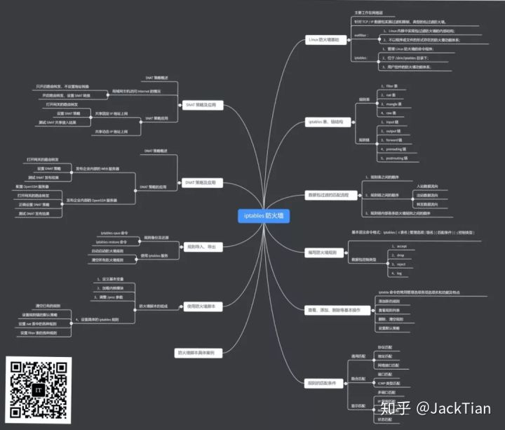
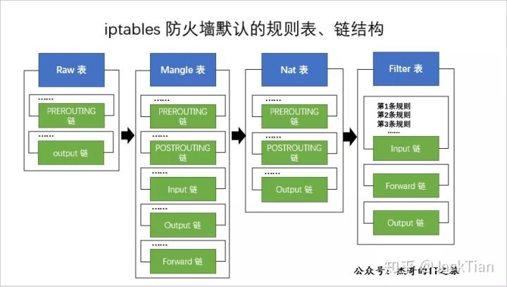
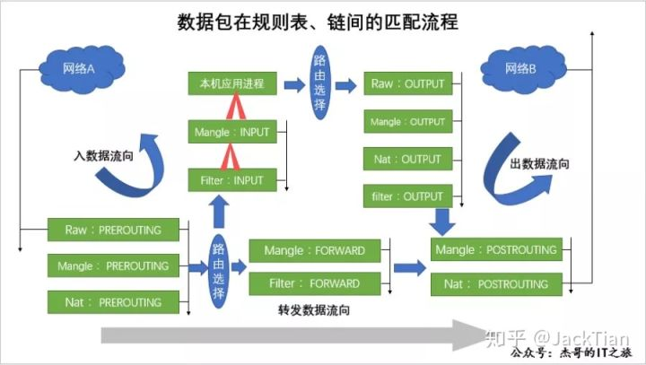

**[iptables go client](https://github.com/moby/libnetwork/blob/master/iptables/iptables.go)**
**[iptables k8s go client](https://github.com/kubernetes/kubernetes/blob/master/pkg/util/iptables/iptables.go)**

# iptables




# iptables 三篇精选文章
**[(1)iptables防火墙-四表/五链、数据包匹配流程、编写iptables规则](https://zhuanlan.zhihu.com/p/84432006)**
**[(2)iptables防火墙-SNAT/DNAT策略及应用](https://zhuanlan.zhihu.com/p/87468533)**
**[(3)iptables防火墙-规则的导出/导入、使用防火墙脚本程序](https://zhuanlan.zhihu.com/p/87483037)**


(1) Linux 防火墙基础
iptables: 属于`用户空间`的防火墙命令工具，来和内核空间的 netfilter 交互，在目录 `/sbin/iptables` 中。
netfilter: Linux 内核中实现包过滤防火墙的内部结构，属于`内核空间`的防火墙工具。

查看所有 iptables 规则
```shell script
iptables -L -n # 默认是 filter 表
# 可以指定表
iptables -t nat -L -n
```

(2)iptables 4种规则表、5种链结构
规则表：对数据包进行过滤或处理
链：容纳多种防火墙规则，五种链中每一个链都会包含多个规则，只是这些规则按照分类又被分为四类，即四张表。


四种规则表：
iptables 管理四个不同的规则表，分别由独立的内核模块管理：
* filter 表: 用来过滤数据包，每一个rule会决定丢弃或处理这个数据包，
内核模块为 iptable_filter，表内包括 `input`、`forward` 和 `output` 三个链。

* nat 表(network address transfer): 主要用来修改数据包的IP地址、端口号信息。
内核模块为 iptable_nat，表包括 `prerouting`、`postrouting` 和 `output` 三个链。

* mangle 表：主要用来修改数据包的`服务类型`、`生存周期`来标记数据包，实现流量整形、策略路由等等功能。
内核模块为 iptable_mangle，表包括 `prerouting`、`postrouting`、`input`、`forward` 和 `output` 五个链。

* raw 表：主要用来是否对数据包进行状态跟踪。
内核模块为 iptable_raw，表包括 `prerouting` 和 `output` 两个链。


五种链：
input 链：访问本地地址的数据包时，使用 input 链规则。
output 链：本机访问外网数据包时，使用 output 链规则。
forward 链：当需要本机防火墙转发数据包到其他地址时，使用 forward 链规则。
prerouting 链：对数据包做路由选择之前，使用 prerouting 链规则。
postrouting 链：对数据包做路由选择之后，使用 postrouting 链规则。



数据包进来时，防火墙开始工作，对应的每一个链内的规则，依次按照规则表顺序为：raw -> mangle -> nat -> filter 表内顺序来处理数据包。

(3)编写防火墙规则(iptables 命令行手动执行)
```shell script
# iptables [-t 表名] 管理选项 [链名] [匹配条件] [-j 控制类型]
# 在 filter 表 INPUT 链中追加(-A: append)一个必须是 TCP 包的 ACCEPT 规则:
iptables -t filter -A INPUT -p TCP -j ACCEPT
# 使用 -I 来管理可以指定规则的顺序号，默认作为第一条规则
# 容许转发 192.168.1.0/24 网段的数据包，但不包括 192.168.123.123
iptables -I FORWARD -s 192.168.123.123 -j REJECT
iptables -I FORWARD -s 192.168.1.0/24 -j ACCEPT
# 来自 192.168.123.0/24 网段IP的数据包，拒绝转发和处理，即直接封锁
iptables -I INPUT -s 192.168.123.0/24 -j DROP
iptables -I FORWARD -s 192.168.123.0/24 -j DROP
```
* 表名、链名：指定iptables命令所操作的表和链，未指定表名时将默认使用filter表；
* 管理选项：表示iptables规则的操作方式，比如：插入、增加、删除、查看等；
* 匹配条件：指定要处理的数据包的特征，不符合指定条件的数据包不在处理；
* 控制类型：指数据包的处理方式，比如：允许、拒绝、丢弃等

(4)编写防火墙规则(go代码执行)
**[linux iptables 官网](https://linux.die.net/man/8/iptables)**
`iptables -t nat -A PREROUTING -m addrtype --dst-type LOCAL -j lx1036` 命令解释：
-m, --match，匹配 addrtype module，该模块包含 `--dst-type type` 参数 `Matches if the destination address is of given type`
-j, --jump target: 该 rule 的 target，如果 packet 与 addrtype 匹配了该跳转到哪里，该 target 可以用户自定义。

(5) SNAT(source network address transfer)/DNAT(destination network address transfer)
> SNAT: 根据指定条件修改数据包的源IP地址。解决问题：一个家只有一个路由器外网IP地址100.200.300.400，但是局域网内每一个设备有内网IP，IP为192.168.31.35的数据包出去时，
先通过交换机端口123，然后到达路由器内网网卡IP100.200.300.401，然后路由转发到达到网关IP100.200.300.400，然后SNAT实现包源IP为100.200.300.400，
然后数据包回来时，到达交换机123端口，再回去192.168.31.35。

*将局域网内的源IP转换为路由器网关IP，数据包再出去外网。*

DNAT: 根据指定条件修改数据包的目的IP地址。


(6)iptables in kube-proxy 和 hairpin mode
hairpin 就是自己访问自己，Pod 有时候使用 service ip 无法访问自己，就是 hairpin 配置问题。kube-proxy 以 iptables 或 ipvs 模式运行，
并且Pod与桥接网络连接时，就会发生这种情况。
kubelet 启动参数会有 --hairbin-mode。


